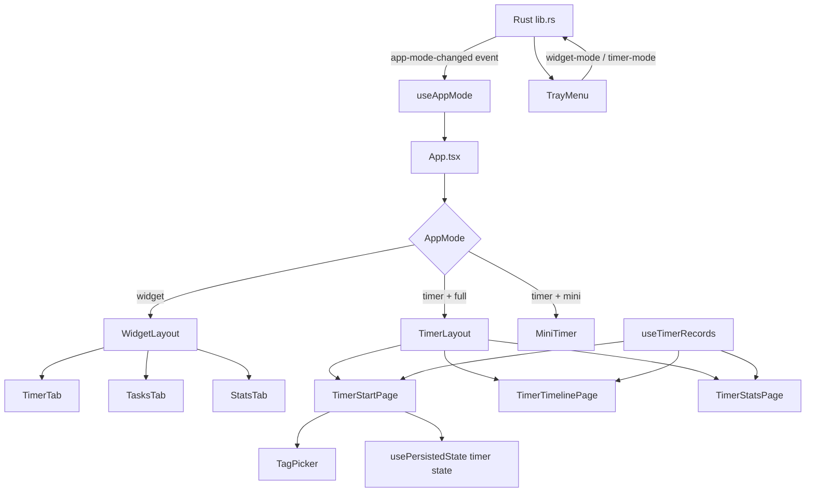
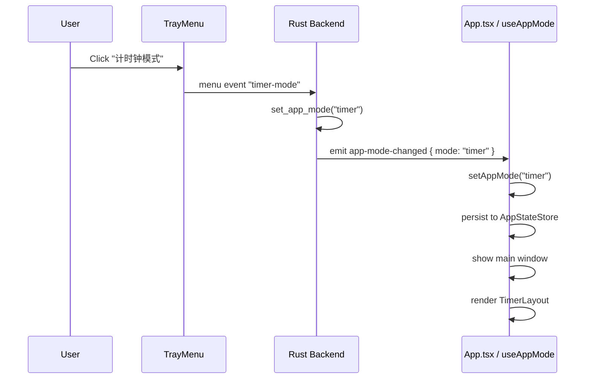
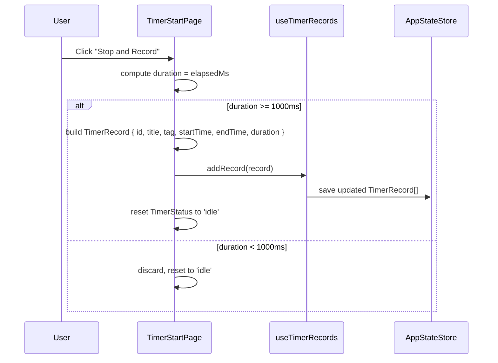

# Design Document: Dual-Mode Architecture

## Overview

This feature refactors the existing Tauri v2 + React + TypeScript desktop widget from a single-mode app into a dual-mode architecture. The app gains a top-level `AppMode` discriminant (`'widget' | 'timer'`) that controls which layout and feature set is rendered. The existing widget functionality (countdown, tasks, progress bars) is preserved unchanged inside a new `WidgetLayout` wrapper. A new `TimerLayout` adds three pages: a live stopwatch start page, a today's timeline page, and an aggregated statistics page. The active mode is persisted to the Tauri Store and can be switched from the system tray menu via a new `set_app_mode` Rust command.

## Architecture



## Sequence Diagrams

### Mode Switch via Tray Menu



### Stop-and-Record Flow



## Components and Interfaces

### Component: `useAppMode` (`src/hooks/useAppMode.ts`)

**Purpose**: Manages the persisted `AppMode` value and listens for backend-emitted mode changes.

**Interface**:
```typescript
function useAppMode(): {
  appMode: AppMode;
  isLoaded: boolean;
  setAppMode: (mode: AppMode) => Promise<void>;
}
```

**Responsibilities**:
- On mount, load `AppMode` from `appStateStore` under key `APP_MODE_KEY = 'app-mode'`; default to `'widget'`
- Fall back to `localStorage` when `__TAURI_INTERNALS__` is absent
- Expose `setAppMode` which updates React state and persists to store within 500 ms
- Listen for the `app-mode-changed` Tauri event (via `@tauri-apps/api/event`) and call `setAppMode` with the received payload
- Unlisten on component unmount

---

### Component: `useTimerRecords` (`src/hooks/useTimerRecords.ts`)

**Purpose**: Manages the `TimerRecord[]` list with Tauri Store persistence and localStorage fallback.

**Interface**:
```typescript
function useTimerRecords(): {
  records: TimerRecord[];
  isLoaded: boolean;
  addRecord: (record: TimerRecord) => Promise<void>;
  getTodayRecords: () => TimerRecord[];
}
```

**Responsibilities**:
- On mount, load `TimerRecord[]` from `appStateStore` under key `TIMER_RECORDS_KEY = 'timer-records'`; default to `[]`
- Fall back to `localStorage` when Tauri Store is unavailable
- `addRecord` appends to the list and persists within 500 ms
- `getTodayRecords` filters records whose `startTime` falls within the current calendar day (local midnight to next midnight)

---

### Component: `WidgetLayout` (`src/components/WidgetLayout.tsx`)

**Purpose**: Wraps the three existing widget tabs inside the dual-mode shell.

**Interface**:
```typescript
interface WidgetLayoutProps {
  activeTab: WidgetTab;
  setActiveTab: (tab: WidgetTab) => void;
  state: ReturnType<typeof usePersistedState>;
  tagStore: ReturnType<typeof useTagStore>;
  accentColor: string;
  onSound: (type: SoundType) => void;
}
```

**Responsibilities**:
- Render `TimerTab`, `TasksTab`, or `StatsTab` based on `activeTab`
- Render the bottom nav with Clock, CheckSquare, BarChart2 icons (same as current `App.tsx`)
- Pass all required props through to existing tab components without modification

---

### Component: `TimerLayout` (`src/components/TimerLayout.tsx`)

**Purpose**: Wraps the three new timer pages with a shared bottom nav.

**Interface**:
```typescript
interface TimerLayoutProps {
  timerTab: TimerTab;
  setTimerTab: (tab: TimerTab) => void;
  records: TimerRecord[];
  addRecord: (record: TimerRecord) => Promise<void>;
  tagStore: ReturnType<typeof useTagStore>;
  state: ReturnType<typeof usePersistedState>;
  accentColor: string;
}
```

**Responsibilities**:
- Render `TimerStartPage`, `TimerTimelinePage`, or `TimerStatsPage` based on `timerTab`
- Render the bottom nav with Play, List, PieChart icons from `lucide-react`
- Apply the same `.widget-container` glassmorphism shell as `WidgetLayout`

---

### Component: `TimerStartPage` (`src/components/TimerStartPage.tsx`)

**Purpose**: Live stopwatch with tag selection and stop-and-record action.

**Interface**:
```typescript
interface TimerStartPageProps {
  state: ReturnType<typeof usePersistedState>; // activityTag, timerStatus, elapsedMs, lastStartedAt
  tagStore: ReturnType<typeof useTagStore>;
  accentColor: string;
  onAddRecord: (record: TimerRecord) => Promise<void>;
}
```

**Responsibilities**:
- Display `TagPicker` for tag selection (reuses existing component)
- Show live elapsed time in `HH:MM:SS` format, updating every second while `timerStatus === 'running'`
- Provide Start / Pause / Resume / Stop-and-Record buttons
- On stop-and-record: build `TimerRecord` with `crypto.randomUUID()` id, call `onAddRecord`, then reset timer state
- Discard records with `duration < 1000 ms`
- Visual design matches `时钟.html`: white inner card (`.timer-start-card`), large monospace time, status dot, category badge, rounded action buttons

---

### Component: `TimerTimelinePage` (`src/components/TimerTimelinePage.tsx`)

**Purpose**: Scrollable vertical timeline of today's timer records.

**Interface**:
```typescript
interface TimerTimelinePageProps {
  records: TimerRecord[]; // pre-filtered to today, passed from parent
}
```

**Responsibilities**:
- Render records in descending `startTime` order (newest first)
- For each record: title, tag sub-label, `formatTimeRange(startTime, endTime)`, `formatDuration(duration)` badge
- Show header with count: `LOGS: N`
- Show empty-state message when `records.length === 0`
- Scrollable content area with custom scrollbar styling
- Visual design matches `时间线.html`: dot markers (`.timeline-dot`), left-aligned spine, scrollable `.timeline-scroll` area

---

### Component: `TimerStatsPage` (`src/components/TimerStatsPage.tsx`)

**Purpose**: Aggregated statistics for today's sessions with donut chart and per-tag breakdown.

**Interface**:
```typescript
interface TimerStatsPageProps {
  records: TimerRecord[]; // pre-filtered to today, passed from parent
}
```

**Responsibilities**:
- Compute total focus time and per-tag totals/percentages from `records`
- Render total time badge using `formatTotalHours(totalMs)`
- Render CSS conic-gradient donut ring (no external chart library) showing top-tag proportions
- Render legend list (top 3 tags) and detail progress bars for all tags
- Assign colors from a predefined palette, cycling if needed
- Show empty-state when `records.length === 0`
- Visual design matches `统计分布.html`: donut ring with inner hole, legend list, detail bars

---

### Modified: `App.tsx` (`src/App.tsx`)

**New state additions**:
```typescript
const { appMode, setAppMode, isLoaded: modeLoaded } = useAppMode();
const { records, addRecord, getTodayRecords } = useTimerRecords();
const [windowState, setWindowState] = useState<WindowState>('full');
const [widgetTab, setWidgetTab] = useState<WidgetTab>('countdown');
const [timerTab, setTimerTab] = useState<TimerTab>('start');
```

**Render logic**:
```typescript
// Mini-timer overlay (timer mode only)
if (windowState === 'mini' && appMode === 'timer') {
  return <MiniTimer ... />;
}

// Full layouts
if (appMode === 'widget') {
  return <WidgetLayout activeTab={widgetTab} setActiveTab={setWidgetTab} ... />;
}
return <TimerLayout timerTab={timerTab} setTimerTab={setTimerTab} records={getTodayRecords()} ... />;
```

**Minimize button logic**:
```typescript
const handleMinimize = () => {
  if (appMode === 'timer') {
    setWindowState('mini');
  } else {
    getCurrentWindow().hide();
  }
};
```

---

### Modified: `src-tauri/src/lib.rs`

**New Tauri command**:
```rust
#[tauri::command]
fn set_app_mode(app: tauri::AppHandle, mode: String) {
    app.emit("app-mode-changed", mode).ok();
}
```

**Extended tray menu** (added between `settings` and `separator`/`quit`):
```rust
let separator2 = PredefinedMenuItem::separator(app)?;
let widget_mode = MenuItem::with_id(app, "widget-mode", "桌面静态挂件模式", true, None::<&str>)?;
let timer_mode  = MenuItem::with_id(app, "timer-mode",  "计时钟模式",       true, None::<&str>)?;
// Menu order: show | settings | separator2 | widget_mode | timer_mode | separator | quit
```

**Menu event handler additions**:
```rust
"widget-mode" => set_app_mode_internal(app, "widget"),
"timer-mode"  => set_app_mode_internal(app, "timer"),
```

**Handler registration**:
```rust
.invoke_handler(tauri::generate_handler![
    get_autostart,
    set_autostart,
    trim_memory,
    set_app_mode,   // new
])
```

## Data Models

### New types in `src/types.ts`

```typescript
// --- Dual-mode types ---

export type AppMode = 'widget' | 'timer';
export type WindowState = 'full' | 'mini' | 'hidden';
export type WidgetTab = 'countdown' | 'tasks' | 'progress';
export type TimerTab = 'start' | 'timeline' | 'stats';

export type TimerRecord = {
  id: string;           // crypto.randomUUID() or timestamp fallback
  title: string;        // tag name when no explicit title
  tag?: string;         // selected activity tag
  startTime: number;    // Unix ms timestamp
  endTime: number;      // Unix ms timestamp
  duration: number;     // total elapsed ms
  note?: string;        // optional user note (future use)
};

export const TIMER_RECORDS_KEY = 'timer-records';
export const APP_MODE_KEY = 'app-mode';
```

**Validation rules**:
- `duration` must be `>= 1000` to be persisted (sub-second records are discarded)
- `endTime >= startTime` always
- `id` is non-empty string
- `title` defaults to `tag ?? 'Untitled'` when not explicitly set

### New utility functions in `src/types.ts`

```typescript
/**
 * Format a duration in milliseconds to a human-readable string.
 * < 1 hour  → "Xm"
 * >= 1 hour → "XhYm"
 */
export function formatDuration(ms: number): string {
  const totalMinutes = Math.max(0, Math.floor(ms / 60_000));
  const hours = Math.floor(totalMinutes / 60);
  const minutes = totalMinutes % 60;
  if (hours === 0) return `${minutes}m`;
  return minutes === 0 ? `${hours}h` : `${hours}h${minutes}m`;
}

/**
 * Format a start/end timestamp pair as "HH:MM - HH:MM" in local time.
 */
export function formatTimeRange(startTime: number, endTime: number): string {
  const fmt = (ts: number) => {
    const d = new Date(ts);
    return `${String(d.getHours()).padStart(2, '0')}:${String(d.getMinutes()).padStart(2, '0')}`;
  };
  return `${fmt(startTime)} - ${fmt(endTime)}`;
}

/**
 * Format a total duration for the stats header badge.
 * < 1 hour  → "Xm"
 * >= 1 hour → "X.Xh"
 */
export function formatTotalHours(ms: number): string {
  const totalMinutes = Math.max(0, Math.floor(ms / 60_000));
  if (totalMinutes < 60) return `${totalMinutes}m`;
  const hours = ms / 3_600_000;
  return `${hours.toFixed(1)}h`;
}
```

## Algorithmic Pseudocode

### useAppMode — Load and Listen

```pascal
PROCEDURE useAppMode()
  OUTPUT: { appMode, isLoaded, setAppMode }

  SEQUENCE
    appMode ← 'widget'
    isLoaded ← false

    ON MOUNT:
      IF Tauri store available THEN
        stored ← appStateStore.get(APP_MODE_KEY)
        appMode ← stored ?? 'widget'
      ELSE
        raw ← localStorage.getItem(APP_MODE_KEY)
        appMode ← raw ?? 'widget'
      END IF
      isLoaded ← true

      unlisten ← listen('app-mode-changed', (event) =>
        setAppMode(event.payload)
      )

    ON UNMOUNT:
      unlisten()

    RETURN { appMode, isLoaded, setAppMode }
  END SEQUENCE
END PROCEDURE

PROCEDURE setAppMode(mode)
  INPUT: mode ∈ AppMode
  SEQUENCE
    appMode ← mode
    IF Tauri store available THEN
      appStateStore.set(APP_MODE_KEY, mode)
      appStateStore.save()
    ELSE
      localStorage.setItem(APP_MODE_KEY, mode)
    END IF
  END SEQUENCE
END PROCEDURE
```

### useTimerRecords — addRecord

```pascal
PROCEDURE addRecord(record)
  INPUT: record of type TimerRecord
  PRECONDITION: record.duration >= 1000

  SEQUENCE
    records ← [...records, record]
    IF Tauri store available THEN
      appStateStore.set(TIMER_RECORDS_KEY, records)
      appStateStore.save()
    ELSE
      localStorage.setItem(TIMER_RECORDS_KEY, JSON.stringify(records))
    END IF
  END SEQUENCE
END PROCEDURE
```

### getTodayRecords — Day Boundary Filter

```pascal
FUNCTION getTodayRecords(records)
  INPUT: records of type TimerRecord[]
  OUTPUT: filtered of type TimerRecord[]

  SEQUENCE
    now ← new Date()
    dayStart ← new Date(now.getFullYear(), now.getMonth(), now.getDate()).getTime()
    dayEnd   ← dayStart + 86_400_000

    filtered ← records.filter(r => r.startTime >= dayStart AND r.startTime < dayEnd)
    RETURN filtered
  END SEQUENCE
END FUNCTION
```

### TimerStartPage — Stop and Record

```pascal
PROCEDURE handleStopAndRecord()
  SEQUENCE
    now ← Date.now()
    totalElapsed ← elapsedMs + (timerStatus = 'running' ? now - lastStartedAt : 0)

    IF totalElapsed < 1000 THEN
      resetTimer()
      RETURN
    END IF

    record ← {
      id:        crypto.randomUUID() ?? String(now),
      title:     activityTag || 'Untitled',
      tag:       activityTag,
      startTime: now - totalElapsed,
      endTime:   now,
      duration:  totalElapsed,
      note:      ''
    }

    AWAIT onAddRecord(record)
    resetTimer()
  END SEQUENCE
END PROCEDURE
```

### TimerStatsPage — Compute Per-Tag Stats

```pascal
FUNCTION computeTagStats(records)
  INPUT: records of type TimerRecord[]
  OUTPUT: stats of type Array<{ tag, totalMs, percentage, color }>

  SEQUENCE
    totalMs ← sum of record.duration for all records
    IF totalMs = 0 THEN RETURN []

    tagMap ← Map<string, number>
    FOR each record IN records DO
      key ← record.tag ?? 'Untagged'
      tagMap[key] ← (tagMap[key] ?? 0) + record.duration
    END FOR

    palette ← ['#1a1a1a', '#6366f1', '#10b981', '#06b6d4', '#94a3b8', ...]

    stats ← tagMap.entries()
      .sort by totalMs descending
      .map((tag, ms, index) => {
        percentage: Math.round(ms / totalMs * 100),
        color: palette[index % palette.length]
      })

    RETURN stats
  END SEQUENCE
END FUNCTION
```

## CSS Additions (`src/App.css`)

New CSS class groups to add, following the existing glassmorphism naming conventions:

### TimerLayout container classes

```css
/* .timer-layout-container — same as .widget-container */
/* .timer-layout-content   — same as .content-area but for timer pages */
/* .timer-layout-nav       — same as .bottom-nav */
```

### TimerStartPage classes

```css
/* .timer-start-card       — white inner card (bg #fff, border-radius 24px, box-shadow) */
/* .timer-start-status-dot — 8px green/grey circle indicating running/paused/idle */
/* .timer-start-tag-badge  — pill badge showing selected tag name */
/* .timer-start-time       — monospace 56px time display */
/* .timer-start-actions    — flex row for action buttons */
/* .timer-start-btn-circle — 48px square-rounded icon button (reset, save) */
/* .timer-start-btn-main   — flex-1 primary action button (dark bg, white text) */
```

### TimerTimelinePage classes

```css
/* .timeline-scroll        — flex-1 overflow-y: auto scrollable area */
/* .timeline-container     — position: relative, padding-left: 28px */
/* .timeline-dot           — 9px circle, position: absolute, left: -28px */
/* .timeline-item          — position: relative, margin-bottom: 20px */
/* .timeline-time-meta     — flex row: time-range + duration-tag */
/* .timeline-duration-tag  — pill badge: bg #f1f0ea, font-size 10px */
/* .timeline-empty         — centered empty-state text */
```

### TimerStatsPage classes

```css
/* .timer-stats-header     — flex row: title + total badge */
/* .timer-stats-total-badge — pill badge showing total hours */
/* .timer-stats-overview   — flex row: donut ring + legend list */
/* .timer-stats-donut      — 80px conic-gradient circle with ::before hole */
/* .timer-stats-legend     — flex column of legend items */
/* .timer-stats-legend-dot — 8px colored circle */
/* .timer-stats-detail-list — flex column of per-tag detail rows */
/* .timer-stats-bar-bg     — 6px track bar */
/* .timer-stats-bar-fill   — colored fill bar */
/* .timer-stats-empty      — centered empty-state text */
```

## Error Handling

### Storage Unavailable

**Condition**: `__TAURI_INTERNALS__` is absent (browser dev mode or store plugin failure)  
**Response**: Both `useAppMode` and `useTimerRecords` fall back to `localStorage` transparently  
**Recovery**: No user-visible error; data persists in localStorage until Tauri Store is available

### Sub-second Record Discard

**Condition**: Stop-and-record clicked with `duration < 1000 ms`  
**Response**: Record is silently discarded; timer resets to `'idle'`  
**Recovery**: No error shown; user can start a new session immediately

### `crypto.randomUUID()` Unavailable

**Condition**: Running in a context without `crypto.randomUUID` (very old browser)  
**Response**: Fall back to `String(Date.now()) + Math.random().toString(36).slice(2)`  
**Recovery**: IDs remain unique enough for local use

### Tray Event Ignored

**Condition**: Unknown tray menu event ID received in Rust  
**Response**: The `_ => {}` catch-all in the menu event handler silently ignores it  
**Recovery**: No crash; existing menu items continue to function

## Testing Strategy

### Unit Testing Approach

Test pure utility functions in isolation:
- `formatDuration`: boundary at 0 ms, 59 min, 60 min, 90 min, 120 min
- `formatTimeRange`: midnight crossing, same-minute range, 23:59 → 00:00
- `formatTotalHours`: boundary at 0 ms, 59 min, 60 min, 90 min
- `computeTagStats` (internal): empty records, single tag, multiple tags, cycling palette
- `getTodayRecords`: records from yesterday, today, tomorrow; midnight boundary

### Property-Based Testing Approach

**Property Test Library**: `fast-check`

Properties are defined in the Correctness Properties section below.

### Integration Testing Approach

- `useAppMode`: mock Tauri event listener; verify mode persists and updates on event
- `useTimerRecords`: mock `appStateStore`; verify append-and-persist behavior
- `TimerStartPage`: render with mock state; simulate start → pause → stop-and-record flow
- Tray menu: verify `set_app_mode` command emits correct event payload

## Performance Considerations

- `getTodayRecords` is called on every render of `TimerLayout`; it is a simple `Array.filter` over an in-memory array and is O(n) with negligible cost for typical daily record counts (< 100)
- The conic-gradient donut in `TimerStatsPage` is pure CSS — no canvas or SVG rendering overhead
- `useTimerRecords` debounces persistence by 500 ms (same pattern as `usePersistedState`) to avoid hammering disk on rapid record additions

## Security Considerations

- `TimerRecord.id` uses `crypto.randomUUID()` which is cryptographically random; no collision risk for local storage
- The `set_app_mode` Tauri command accepts only a `String` payload; the frontend validates it against the `AppMode` union before applying
- No user-provided data is executed as code; all record fields are stored as plain JSON

## Dependencies

No new npm packages are required. All new components use:
- `lucide-react` — already installed (Play, List, PieChart icons)
- `@tauri-apps/api/event` — already available (for `listen` in `useAppMode`)
- `@tauri-apps/plugin-store` — already installed (via `appStateStore`)
- `motion/react` — already installed (for `AnimatePresence` if needed in tab transitions)

No new Rust crates are required. The `app.emit` API is part of the existing `tauri` crate.

## File Change Summary

### New files

| File | Purpose |
|------|---------|
| `src/hooks/useTimerRecords.ts` | Manages `TimerRecord[]` with Tauri Store + localStorage fallback |
| `src/hooks/useAppMode.ts` | Manages `AppMode` with persistence and Tauri event listener |
| `src/components/WidgetLayout.tsx` | Wraps existing three widget tabs |
| `src/components/TimerLayout.tsx` | Wraps three new timer pages with bottom nav |
| `src/components/TimerStartPage.tsx` | Live stopwatch with tag selection and record creation |
| `src/components/TimerTimelinePage.tsx` | Vertical timeline of today's records |
| `src/components/TimerStatsPage.tsx` | Donut chart + per-tag stats for today |

### Modified files

| File | Changes |
|------|---------|
| `src/types.ts` | Add `AppMode`, `WindowState`, `WidgetTab`, `TimerTab`, `TimerRecord`, `TIMER_RECORDS_KEY`, `APP_MODE_KEY`, `formatDuration`, `formatTimeRange`, `formatTotalHours` |
| `src/App.tsx` | Add `useAppMode`, `useTimerRecords`, `windowState`, `widgetTab`, `timerTab` state; refactor render to dual-mode logic; update minimize button handler |
| `src/App.css` | Add `.timer-start-*`, `.timeline-*`, `.timer-stats-*` CSS classes |
| `src-tauri/src/lib.rs` | Add `set_app_mode` command; extend tray menu with mode submenu items; register command in `generate_handler!` |

---

## Correctness Properties

*A property is a characteristic or behavior that should hold true across all valid executions of a system — essentially, a formal statement about what the system should do. Properties serve as the bridge between human-readable specifications and machine-verifiable correctness guarantees.*

### Property 1: formatDuration returns non-empty string for all non-negative inputs

*For any* non-negative millisecond value `ms`, `formatDuration(ms)` SHALL return a non-empty string.

**Validates: Requirements 10.1, 10.4**

### Property 2: formatTimeRange matches HH:MM - HH:MM pattern for valid timestamp pairs

*For any* pair of timestamps where `endTime >= startTime >= 0`, `formatTimeRange(startTime, endTime)` SHALL return a string matching the pattern `\d{2}:\d{2} - \d{2}:\d{2}`.

**Validates: Requirements 10.2, 10.5**

### Property 3: formatTotalHours returns non-empty string for all non-negative inputs

*For any* non-negative millisecond value `ms`, `formatTotalHours(ms)` SHALL return a non-empty string.

**Validates: Requirements 10.3**

### Property 4: getTodayRecords only returns records from the current calendar day

*For any* array of `TimerRecord` values with arbitrary `startTime` values, `getTodayRecords` SHALL return only records whose `startTime` falls within `[dayStart, dayStart + 86_400_000)` where `dayStart` is the local midnight timestamp.

**Validates: Requirements 6.1, 7.1**

### Property 5: addRecord appends and persists — round-trip consistency

*For any* valid `TimerRecord` with `duration >= 1000`, after calling `addRecord(record)`, the record SHALL appear in the `records` array and SHALL be retrievable from the persisted store.

**Validates: Requirements 5.2, 5.3**

### Property 6: Sub-second records are never persisted

*For any* `TimerRecord` with `duration < 1000`, calling the stop-and-record handler SHALL result in no new record being appended to `records` and no store write for that record.

**Validates: Requirements 4.8**

### Property 7: computeTagStats percentages sum to 100 for non-empty record sets

*For any* non-empty array of `TimerRecord` values, the sum of all `percentage` values returned by `computeTagStats` SHALL equal 100 (within rounding tolerance of ±1 due to integer rounding).

**Validates: Requirements 7.3, 7.4**

### Property 8: AppMode persistence round-trip

*For any* `AppMode` value `m`, after calling `setAppMode(m)` and reloading from the store, the loaded value SHALL equal `m`.

**Validates: Requirements 1.2, 1.3, 1.4**
